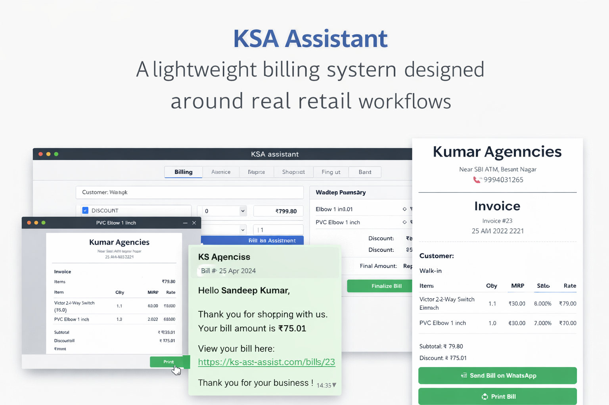

<h1 align="center">KSA Assistant</h1>

 
  <em>
    A lightweight billing and catalogue system built for real retail workflows —
    not enterprise rigidity.
  </em>

  <strong>Status:</strong> v1.0 completed · Actively used · Data-driven roadmap

 

  

---

## Why KSA Assistant exists

<strong>Click to expand</strong>

 

Most small retail shops already use paid invoicing and inventory software.

What they struggle with is not a lack of features — but **rigidity**.

- Workflows that don’t match daily reality  
- Navigation that requires training  
- High upfront and recurring subscription costs  
- Data that is recorded, but rarely understood  

During real shop visits, one thing became clear:

> Software alone does not increase sales.  
> **Understanding data — and asking the right questions — does.**

**KSA Assistant was built from the opposite direction:**

- Observe real workflows first  
- Capture clean, reliable transactional data  
- Enable analysis before optimisation  

Instead of forcing businesses into software,
the software adapts to how businesses already work.

---

## What KSA Assistant does (v1.0)

KSA Assistant focuses on **doing a few things well**, reliably.

- 🧾 **Billing** — fast bill creation with item & bill-level discounts  
- 🗂️ **Catalogue** — simple product management  
- 🖨️ **Invoice printing** — supports long, multi-page bills  
- 📲 **WhatsApp sharing** — send bills instantly to customers  
- 💾 **SQLite persistence** — lightweight, reliable local storage  

> v1.0 prioritises **usability and stability**, not feature volume.

---

## What this project is *not*

❌ Not an enterprise POS system  
❌ Not a GST-heavy accounting tool  
❌ Not a feature-complete inventory suite (yet)  

✅ It *is* a focused system designed to evolve through **real usage and data**.

---

## Design decisions (intentional, not accidental)

- **SQLite**  
  Chosen for simplicity, reliability, and ease of analysis.  
  Data is never tied to proprietary formats.

- **WhatsApp over email**  
  Matches real customer behaviour in small retail contexts.

- **No inventory in v1.0**  
  Inventory affects operations.  
  Visibility must come before control.

- **Filters before inventory**  
  Understanding patterns matters more than tracking stock early.

- **Simple UI over feature density**  
  Software should not require a course to use.

---

## Data & analysis perspective

KSA Assistant is built alongside an academic focus on  
**Business Data Management (IIT Madras BS – Data Science).**

A core principle of this project:

> Sales don’t increase because of software.  
> Sales improve when data answers the right questions.

This system is designed to:
- Capture clean transactional data
- Enable meaningful analysis
- Support evidence-based decisions over time

The software is an **instrument**, not the solution.

---

## Roadmap (deliberate & versioned)
- v1.0 ── Billing & Catalogue ✅ Completed
- v1.1 ── Visibility (filters, smart search)
- v1.5 ── Basic inventory management
- v2.0 ── Inventory + analytics

No rushed features.  
No speculative promises.

---

## Real-world usage

- Designed for daily use in small retail shops  
- Tested with real billing workflows  
- Built to remain understandable months later — not just impressive on day one  

This project values **trust and longevity** over speed.

---

## Data safety & deployment philosophy

- SQLite database is **never committed to Git**
- Production data lives on persistent storage
- Backups are treated as a first-class concern
- Code and data are intentionally separated

> Losing customer data is not a bug — it’s a failure.

---

## Project context

This project is part of a longer academic and practical journey:

- IIT Madras BS — Data Science  
- Focus area: Business Data Management  
- Goal: bridge real operations with analytical thinking  

KSA Assistant exists at the intersection of:
**software · business · data · reality**

---

## Closing note

KSA Assistant is not trying to be everything.

It is trying to be:
- understandable
- adaptable
- honest about its scope
- guided by data, not assumptions

That philosophy guides both the code and the roadmap.

